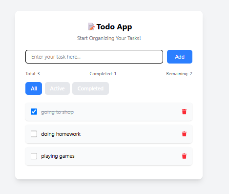

# 📝 React Todo App

A clean and responsive Todo application built with React and Tailwind CSS.

## ✨ Features

- ➕ Add new tasks
- ✅ Mark tasks as completed
- ❌ Delete tasks
- 🔍 Filter tasks (All, Active, Completed)
- 📊 Task statistics (Total, Completed, Remaining)
- 💾 Local Storage support
- 📱 Responsive design

## 🛠️ Technologies Used

- React
- JavaScript (ES6+)
- Tailwind CSS
- Vite

## 🚀 Installation

```bash
git clone https://github.com/sam123227/react-todo-app.git
cd react-todo-app
npm install
npm run dev
```

## 📸 Screenshot




## 👨‍💻 Author

Samir
